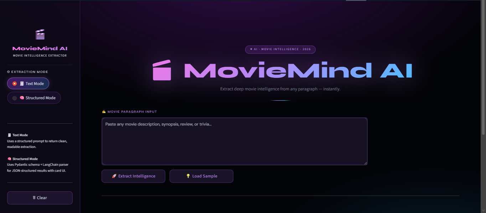
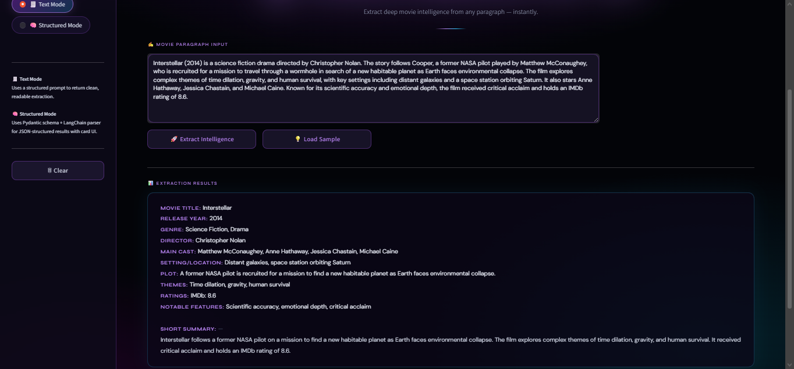
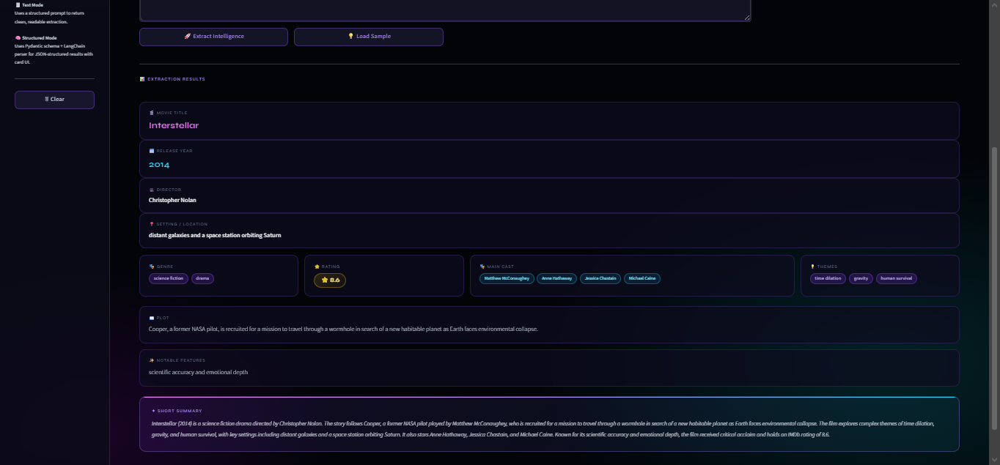
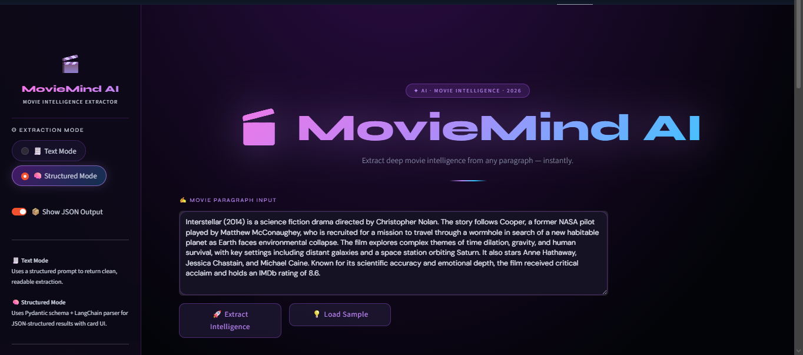

<div align="center">

<!--
  ╔══════════════════════════════════════════════════════╗
  ║          RESUMIND AI — PREMIUM README                ║
  ║        Designed to impress. Built to convert.        ║
  ╚══════════════════════════════════════════════════════╝
-->

<!-- ═══════════════════════ TOP BANNER ═══════════════════════ -->


<br/>

<!-- ═══════════════════════ TYPING ANIMATION ═══════════════════════ -->


<br/><br/>

<!-- ═══════════════════════ BADGES ROW 1 ═══════════════════════ -->

<p>

&nbsp;

&nbsp;

&nbsp;

</p>

<!-- ═══════════════════════ BADGES ROW 2 ═══════════════════════ -->

<p>

&nbsp;

&nbsp;

&nbsp;

</p>

<br/>

<!-- ═══════════════════════ CTA BUTTONS ═══════════════════════ -->

<a href="https://huggingface.co/spaces/prathamvishwakarma/resumind-ai">
  
</a>
&nbsp;&nbsp;
<a href="https://github.com/Pratham11423/resumind-ai">
  
</a>
&nbsp;&nbsp;
<a href="https://github.com/Pratham11423/resumind-ai/blob/main/app.py">
  
</a>

<br/><br/>


<br/>

> ### *"Not just a UI wrapper — a production AI pipeline that transforms raw resume text into structured career intelligence."*

<br/>

</div>

---

## 📄 &nbsp;Visual Demo

<br/>

<div align="center">

| 🏠 Welcome Screen | 🤖 Extraction in Action |
|:-:|:-:|
|  |  |

<br/>

| 🧠 Structured Mode — Card UI | ⚠️ Empty / Error State |
|:-:|:-:|
|  |  |

</div>

<br/>

---

## 🚀 &nbsp;Live Deployment

<br/>

<div align="center">


&nbsp;

&nbsp;


<br/><br/>

ResuMind AI is fully deployed and publicly accessible — no setup required. Click below to open the live app:

<br/>

<a href="https://huggingface.co/spaces/prathamvishwakarma/resumind-ai">
  
</a>

<br/><br/>

```
URL  →  https://huggingface.co/spaces/prathamvishwakarma/resumind-ai
Host →  HuggingFace Spaces
Infra →  Docker  (python:3.13.5-slim base image)
Port →  8501  (Streamlit default)
Auth →  MISTRAL_API_KEY  injected via HF Secrets
```

<br/>

| Detail | Value |
|:-------|:------|
| 🌐 Platform | HuggingFace Spaces |
| 🐳 Container | Docker — `python:3.13.5-slim` |
| ⚙️ Framework | Streamlit `>=1.35` |
| 🔑 Secrets | `MISTRAL_API_KEY` via HF Repository Secrets |
| 📡 Port | `8501` exposed, `0.0.0.0` binding |
| 🔄 CI | Auto-rebuild on every `git push` to `main` |

</div>

<br/>

---

## ✨ &nbsp;Features

<br/>

<table>
<tr>
<td width="50%" valign="top">

**🔍 &nbsp;Dual Extraction Engine**

Two architectures, one interface:

- 🧾 **Text Mode** — Precision-crafted system prompt via `ChatPromptTemplate`. Returns clean, human-readable output with NULL-safe field defaults. Perfect for quick reads.
- 🧠 **Structured Mode** — Pydantic schema + `PydanticOutputParser`. Returns fully typed, validated JSON rendered as an interactive card UI.

</td>
<td width="50%" valign="top">

**🧠 &nbsp;Mistral AI Core**

Model: `mistral-small-2506`

Fast, accurate, cost-efficient inference. Handles multi-page resumes, missing fields, and varied formats with grace.

Zero-hallucination policy — unknown fields return `NULL`, never fabricated values.

</td>
</tr>
<tr>
<td width="50%" valign="top">

**⚡ &nbsp;LangChain Pipeline**

Full production chain:
- `ChatPromptTemplate` — structured prompt engineering
- `ChatMistralAI` — model binding layer
- `PydanticOutputParser` — typed schema validation
- `@st.cache_resource` — warm model caching
- Chainable, composable, extensible

</td>
<td width="50%" valign="top">

**📊 &nbsp;Pydantic Schema Output**

`ResumeInfo` model fields:
```python
full_name · email · phone
skills[] · experience[]
education[] · certifications[]
projects[] · languages[]
summary · ats_score
```

</td>
</tr>
<tr>
<td width="50%" valign="top">

**🎨 &nbsp;2026-Level UI Design**

- Glassmorphism panels (blur + transparency)
- Neon green / teal gradient system
- Animated `hue-rotate` background pulse
- Staggered card entrance animations
- Hover lift + glow border effects
- `Syne` display + `DM Sans` body fonts

</td>
<td width="50%" valign="top">

**🛠️ &nbsp;Developer-Grade UX**

- One-click sample input (demo resume)
- Raw JSON output toggle
- Copy-friendly code block output
- Graceful error UI with recovery
- Clear / reset session button
- Fully responsive Streamlit layout

</td>
</tr>
</table>

<br/>

---

## 🧩 &nbsp;How It Works

<br/>

```
┌─────────────────────────────────────────────────────────────────────┐
│                     RESUMIND AI — PIPELINE                          │
│  ─────────────────────────────────────────────────────────────────  │
│                                                                     │
│   📝  User Input  (resume text / paste / upload)                    │
│         │                                                           │
│         ▼                                                           │
│   ⚙️   LangChain  ChatPromptTemplate                                │
│         │  formats text into system + human message pair            │
│         ▼                                                           │
│   🤖   Mistral AI  (mistral-small-2506)                             │
│         │  extracts entities, fields, semantics                     │
│         ▼                                                           │
│   🔀   Mode Branch                                                  │
│         ├──▶  🧾  Text Mode   →  clean readable field output       │
│         └──▶  🧠  Structured  →  PydanticOutputParser → JSON       │
│                                                                     │
│         ▼                                                           │
│   🎴   Streamlit UI renders results                                 │
│         ├──  Text Mode   →  syntax-highlighted formatted block      │
│         └──  Structured  →  animated cards + tags + chips          │
│                                                                     │
└─────────────────────────────────────────────────────────────────────┘
```

<br/>

<div align="center">

| Step | Action | Technology |
|:----:|:-------|:----------:|
| 1️⃣ | Paste any resume text into the input area | Streamlit UI |
| 2️⃣ | LangChain formats the prompt with system instructions | `ChatPromptTemplate` |
| 3️⃣ | Mistral AI processes and extracts structured fields | `ChatMistralAI` |
| 4️⃣ | Output parsed — plain text or validated Pydantic schema | `PydanticOutputParser` |
| 5️⃣ | Results rendered as premium card UI or formatted block | Streamlit + CSS |

</div>

<br/>

---

## 🏗️ &nbsp;Tech Stack

<br/>

<div align="center">

| Layer | Technology | Role |
|:-----:|:----------:|:-----|
| 🖥️ Frontend |  | UI framework with custom glassmorphism CSS |
| 🧠 AI Model |  | `mistral-small-2506` language model |
| ⛓️ Orchestration |  | Prompt templates + chain management |
| 📐 Schema |  | Structured output parsing + validation |
| 🐍 Runtime |  | Core application language |
| 🐳 Container |  | Reproducible deployment environment |
| ☁️ Hosting |  | Cloud hosting — auto-build on push |

</div>

<br/>

---

## ⚙️ &nbsp;Installation

<br/>

**1 — Clone the repo**

```bash
git clone https://github.com/prathamvishwakarma/resumind-ai.git
cd resumind-ai
```

**2 — Install dependencies**

```bash
pip install -r requirements.txt
```

**3 — Configure environment**

```bash
touch .env
```

```env
# .env
MISTRAL_API_KEY=your_mistral_api_key_here
```

> 🔑 &nbsp;Get your free Mistral API key at [console.mistral.ai](https://console.mistral.ai)

**4 — Launch**

```bash
streamlit run app.py
```

Open **http://localhost:8501** in your browser.

<br/>

---

## ▶️ &nbsp;Usage

<br/>

```
01  Open the app at localhost:8501  (or visit the live HuggingFace link)

02  Choose extraction mode from the sidebar:
       🧾  Text Mode       →  Clean, readable field-by-field output
       🧠  Structured Mode →  Premium card UI + JSON schema view

03  Paste any resume text — raw copy-paste from PDF, LinkedIn, or Word

04  Hit  🚀 Extract Intelligence

05  View results instantly:
       Text Mode   →  syntax-highlighted structured text block
       Structured  →  animated cards, skill tags, experience chips, ATS score badge

06  Toggle  📦 Show JSON Output  in sidebar (Structured Mode only)
07  Use  💡 Load Sample  to test with the built-in demo resume
08  Use  🗑 Clear  to reset session and start fresh
```

<br/>

**Example Input:**

```text
Pratham Vishwakarma | pratham@email.com | +91-XXXXXXXXXX | LinkedIn: /in/prathamvishwakarma
Software Engineer — 2 years experience in Python, FastAPI, and ML deployment.
B.Tech Computer Science, XYZ University, 2023. Skills: Python, Docker, LangChain,
Streamlit, Scikit-learn, SQL. Projects: ResuMind AI, StockSense Dashboard.
Certifications: Google Cloud Associate, DeepLearning.AI ML Specialization.
```

**Example Output — Text Mode:**

```
Full Name:        Pratham Vishwakarma
Email:            pratham@email.com
Phone:            +91-XXXXXXXXXX
Skills:           Python, Docker, LangChain, Streamlit, Scikit-learn, SQL
Experience:       Software Engineer — 2 years
Education:        B.Tech Computer Science, XYZ University (2023)
Certifications:   Google Cloud Associate · DeepLearning.AI ML Specialization
Projects:         ResuMind AI · StockSense Dashboard
ATS Score:        84/100

Short Summary:    A results-driven engineer with hands-on ML deployment experience
                  and a strong portfolio of production AI applications.
```

<br/>

---

## 📁 &nbsp;Project Structure

<br/>

```
resumind-ai/
│
├── 📄  app.py                ← Main Streamlit application
├── 📋  requirements.txt      ← Python dependencies
├── 🐳  Dockerfile            ← HuggingFace Docker config
├── 📖  README.md             ← You are here
├── 🔐  .env                  ← API keys (never commit this)
│
├── 📸  welcome.png           ← Screenshot: welcome screen
├── 📸  chat.png              ← Screenshot: extraction demo
├── 📸  structured.png        ← Screenshot: structured mode
└── 📸  error.png             ← Screenshot: error / empty state
```

<br/>

---

## 💎 &nbsp;Why ResuMind Is Different

<br/>

<div align="center">

```
  ╔═══════════════════════════════════════════════════════╗
  ║           NOT JUST ANOTHER AI WRAPPER                 ║
  ╚═══════════════════════════════════════════════════════╝
```

</div>

<br/>

| &nbsp; | What | Why It Matters |
|:-:|:-----|:--------------|
| 🔬 | **Real AI Pipeline** | Full LangChain chain — not a raw API call. Prompt engineering, model binding, and typed parsing are all composable and swappable. |
| 🔀 | **Dual Extraction Modes** | Two distinct architectures in one UI — text for humans, structured for downstream integrations or APIs. |
| 🛡️ | **NULL-Safe Design** | Missing fields return `NULL`. The model is explicitly instructed never to guess or fabricate unknown values. |
| 🎨 | **Portfolio-Grade SaaS UI** | Glassmorphism, neon gradients, animated backgrounds, staggered cards — it looks like a funded startup, not a hackathon demo. |
| ☁️ | **Production Deployed** | Live on HuggingFace Spaces with Docker — real infrastructure, real CI/CD, not just a localhost screenshot. |
| 🧩 | **Extensible Architecture** | Swap Mistral for GPT-4o in one line. Extend `ResumeInfo`. Add ATS scoring or job-match modes in minutes. |

<br/>

---

## 🤝 &nbsp;Contributing

<br/>

```bash
# Fork → Clone → Branch → Code → PR

git checkout -b feature/your-feature-name
git commit -m "feat: describe your change"
git push origin feature/your-feature-name
# Open a Pull Request on GitHub
```

**Ideas welcome:**
- 🌐 Multi-LLM support (OpenAI, Gemini, Cohere)
- 📊 Job description matching / ATS score comparison
- 🗂️ Export results to PDF or Word
- 🌍 Multi-language resume support
- 🧪 Unit tests for the extraction pipeline

<br/>

---

## 📜 &nbsp;License

<br/>

<div align="center">

Distributed under the **MIT License** — free to use, fork, and build upon.

See [`LICENSE`](LICENSE) for full details.

</div>

<br/>

---

## 👨‍💻 &nbsp;Author

<br/>

<div align="center">


<br/><br/>

**Pratham Vishwakarma**

*Building AI products that look as good as they work.*

<br/>

<a href="[https://github.com/Pratham11423](https://github.com/Pratham11423)">
  
</a>
&nbsp;&nbsp;
<a href="https://huggingface.co/prathamvishwakarma">
  
</a>

</div>

<br/>

---

<!-- ═══════════════════════ BOTTOM BANNER ═══════════════════════ -->

<div align="center">


<br/>

**If this project impressed you — drop a ⭐&nbsp; It takes 2 seconds and means everything.**

<br/>

[](https://github.com/Pratham11423/resumind-ai)
&nbsp;&nbsp;
[](https://github.com/Pratham11423/resumind-ai/fork)

</div>
